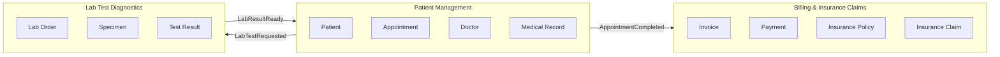

# Week 2 Lab: Healthcare Portal Modernisation

## Task 1: Domain Context Mapping

| Bounded context | Primary entities |
|---|---|
| Patient Management | Patient, Appointment, Doctor, Medical Record |
| Billing & Insurance Claims | Invoice, Payment, Insurance Policy, Insurance Claim |
| Lab Test Diagnostics | Lab Order, Specimen, Test Result |

**Why these boundaries**
- Patient Management: owned by clinical staff, changed for medical reasons.
- Billing & Insurance Claims: owned by finance, changed for money and insurance rules.
- Lab Test Diagnostics: owned by lab technicians, changed for testing reasons.

### Context diagram


## Task 2: User Stories (Patient Care) Patient Management
### Story 1: Book an appointment
**As a** patient, **I want to** book an appointment online with my chosen doctor, **so that** I avoid queuing and waiting time drops by 30%.

**Acceptance criteria**
```gherkin
Scenario: Patient books an available slot
  Given a doctor has an open slot at "2026-10-15T10:00:00Z"
  When the patient selects that slot and confirms the booking
  Then the system should reserve the slot for the patient
  And emit an "AppointmentBooked" event to the Notification Service
  And display a confirmation message with the appointment details
```

### Story 2: Fill in medical forms online
**As a** patient, **I want to** fill my medical forms online before appointment, **so that** I can go straight to my doctor when I arrive and my time in the waiting room drops by 40%.

**Acceptance criteria**
```gherkin
Scenario: Patient completes medical forms online before the visit
  Given a patient has a booked appointment for "2026-10-15T10:00:00Z"
  And the patient has logged in to the portal
  When the patient completes and submits the pre-visit medical form
  Then the system should save the answers to the patient's medical record
  And mark the appointment as "forms completed"
  And notify the front desk that the patient is ready to be seen
  And display a confirmation message to the patient
```


